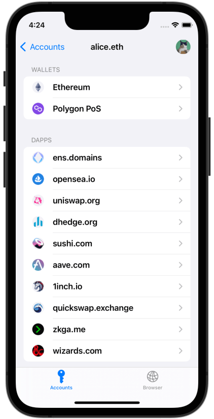

 

  

> Experiment freely with Web3. 
> 
> SealVault is the Web3 key manager that's got your back.

## Features

### Automated burner wallets :fire:  

When you add a dapp to your account, a new key is generated just for this dapp.
Wallet addresses are never connected to dapps. 
This protects you from phishing and mitigates compromised dapps.
[Learn more.](https://sealvault.org/burners/)

### Automatic transaction approval 🥳

You decide which dapp to add, after that transactions are approved
automatically.
[Learn more.](https://sealvault.org/burners/)

### Move assets between wallets and dapps 💰

First class token transfer support for dapp addresses. 
You can also transfer a pre-configured amount automatically when you add a new dapp. 
[Learn more.](https://sealvault.org/burners/)

### Isolated identities 🕶️

Organize your dapps into accounts for isolated identities. 
[Learn more.](https://sealvault.org/privacy/)</figcaption>

    
    

## Status

The project is currently in alpha stage with an iOS app and Polygon PoS support.
Support for more platforms and blockchains is coming. You can find out more in the [intro blog post.](https://sealvault.org/blog/web3-vision/)

The iOS beta starts October 2022. You can sign up for an invite [here.](https://76u1o4gk7en.typeform.com/to/DxKsEMKM)

## [Developer Docs](https://sealvault.org/dev-docs/)

Documentation for SealVault developers containing design documents on the
[security](https://sealvault.org/dev-docs/design/security-model/) and [privacy](https://sealvault.org/dev-docs/design/privacy-model/) models of the application and more.

## Components

### [Core](./core)

Cross-platform key and transaction management for Web3 written in Rust. 
Uses SQLite for storage and depends on platform-specific keychain to store 
key encryption keys.
Exposed to host languages via [uniffi-rs](https://github.com/mozilla/uniffi-rs).

### [iOS](./ios)

iOS Web3 password manager app with a built-in web browser. Written in Swift with 
the SwiftUI framework.

### [Tools](./tools)

Contains development server for integration testing in-page providers and other 
miscellaneous development tools written in Rust.

### [Website](./website)

Provides landing page and features for end users, developer documentation for
SealVault developers and the SealVault blog. Powered by [Material for
MkDocs](https://squidfunk.github.io/mkdocs-material/).

## Development

On first time setup, install the [requirements](#development-requirements)
listed below and then run `./ci.py` from the repo root to check if everything
was installed correctly. (:warning: The CI script will reset all iOS simulators
on your machine.)

The CI script will also create the generated files for you that are a
prerequisites for an Xcode build. Alternatively you can generate these files by
running `fastlane pre_build` in the `ios` directory.

### Development Requirements

- MacOS Monterey and an Apple Silicon Mac for iOS development. You may be able 
  to work on an Intel Mac, but we won't be able to help you with Rust-related 
  build issues as the maintainers are on Apple Silicon.
- XCode 14 IDE and CLI tools
  - Get the Xcode IDE from the app store and
    then run `xcode-select --install` to install CLI tools.
  - You can also install Xcode from the MacOS app store, but the download is
    extremely slow.
- The [Homebrew](https://brew.sh/) macOS package manager, then run `brew bundle`
  from the repo root to install the dependencies specified in the
  [`Brewfile`.](./Brewfile)
- Run `rustup init` which was installed from the [`Brewfile`](./Brewfile) 
  toolchain and follow the instructions to set up your Rust toolchain.
- The [Diesel](https://diesel.rs/) ORM CLI that we use to manage Sqlite:
  - `cargo install diesel_cli --no-default-features --features sqlite` 
- The [Solidity](https://docs.soliditylang.org/en/v0.8.16/index.html) compiler 
  version manager and `solc 0.8.16` that are needed to compile test contracts 
  for unit tests:
  - `cargo install svm-rs` then `svm install 0.8.16`
- The [Foundry](https://book.getfoundry.sh/getting-started/installation) 
  Ethereum development tools of which Anvil is needed for unit tests.

### Tests

Run all tests from the repo root with: `./ci.py`. (:warning: The CI script will
reset all iOS simulators on your machine.)

### Useful commands

- Update Rust toolchain to latest nightly: `rustup update`.
  - We need nightly for iOS simulator on MacOS Apple Silicon.
  - If the CI fails for you locally, make sure you're on the latest nightly.
- Clean Rust build from repo root: `cargo clean`.
- Rebuild Rust XCFramework for iOS and regenerate Swift bindings from `ios`
  directory: `fastlane pre_build`
- Clean Xcode build from `ios` directory: `fastlane clean`.

