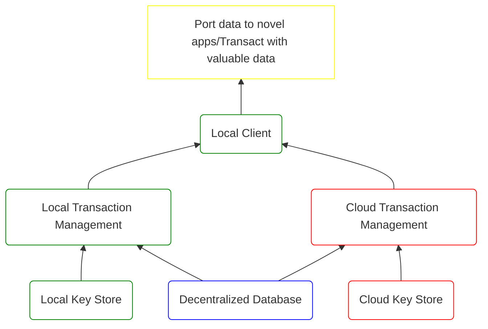

# Why Web3 Is Inevitable, How It Can Go Wrong, and What to Do About It

## Intro

We believe that general purpose decentralized databases will be ubiquitous in
the future, but we see two major obstacles to realizing truly decentralized web
applications: The immediate problem is that it's very difficult to experiment
with new dapps due to safety and UX issues and this slows down progress.  The
longer term problem is that wallets need to be reinvented, otherwise the
majority of internet users won't own their keys.  We try to fix both with
[SealVault.](https://sealvault.org)

<!-- more -->

## What Is Web3

Web3 refers to the emerging shift in internet value chains from permissioned,
centralized databases to permissionless, decentralized databases[^10] where users
own[^20] their data.  The driving force behind Web3 is that we can now enforce
invariants on state transitions in a permissionless, decentralized manner for a
limited set of applications (mostly financial).  For an even more limited set of
applications, we can also enforce invariants while preserving the
confidentiality of transactions.

With hindsight, the two technological breakthroughs that proved decentralized
databases possible were Bitcoin and Zerocash. Bitcoin showed that state-machine
replication (SMR) is solvable in a distributed, permissionless, partially
synchronous setting with Byzantine fault tolerance. Zerocash showed that
zero knowledge succinct non-interactive arguments of knowledge (zk-SNARKs) can 
be used to ensure the confidentiality of transactions in this SMR setting.

While state-of-the-art blockchains in 2022 are best seen as special (financial)
purpose decentralized databases, we are fairly certain that general purpose
decentralized databases with confidential transactions will emerge in the 2020s,
because:

1. Iterative improvements on the state-of-the-art can likely get us to general
purpose decentralized databases.
2. Since there is an established way to monetize decentralized databases,[^30]
the incentives to build them are very high, and thanks to the recent crypto
bubbles, funding is abundant for cryptographers and distributed systems
researchers.

## Web3 Is Inevitable

We believe that the shift in internet value chains to permissionless,
decentralized databases is inevitable, once they become available, because:

1. Decentralized databases enable permissionless innovation with data.
2. Synthetic data can be valuable.
3. Composability is infectious.

### Permissionless Innovation

We have already seen the flurry of financial innovation[^40] in decentralized
finance ignited by smart chains, and we'll see a similar innovation explosion in
all web applications[^50] once general purpose decentralized databases become
available thus drawing more and more internet users to Web3 in a virtuous cycle.
Another way to look at this is that data becomes open as code is open with all
its implications for innovation.

### Valuable Data

While the value of ownership is already clear to crypto native users,
data ownership will draw other users to Web3 once the wealth it creates becomes
apparent.  Synthetic data can be valuable as proven by thriving black markets
for MMORPGs, and given a choice between investing time in applications
where data is owned by a third party, users will naturally choose Web3
applications even if the initial user experience is inferior.  Viewing
blockchain technology as disruptive to centralized databases is a good framework
for thinking about this.[^55]

### The Law of Potential Composition

Composable data is user data that can be combined with data from untrusted
counterparties to produce composable data subject to some invariants.
Decentralized databases store and produce composable data.

Fungible tokens are examples of composable data. Eva Lu Ator can send tokens to
Alyssa who can add some of her own tokens and send them to Ben and so on ad
infinitum.

Non-fungible tokens (NFTs) are also composable data.  An on-chain game may allow
Eva to use a cartoon NFT to assume control of an advanced character and defeat
Alyssa's advanced character to gain experience.  Lem E. Tweakit may grow irate
with the game and fork it to build a better game which Eva can try out with her
improved character and play against Ben's character that was leveled up in the
new game.  And so on.

In the blockchain world all on-chain data is permissionlessly composable by
default.  In the Web2 world composable data manifests in user data that is
accessible through permissioned APIs.[^60]  So at a minimum we can say that
composable data in Web3 will be all on chain data + all user data currently
accessible through Web2 APIs.

How do we decide what data to store in a decentralized database?  Well, we can
rule out certain classes of data like private keys, but if we are uncertain,
then it makes sense to store data in a decentralized database in case it becomes
composable and thus more useful.[^67] This is the *Law of Potential Composition*
which is a major driving force behind the eventual ubiquity of composable data
and decentralized databases.

!!! info "How is composable data produced in Web3?"

    First, a programmer takes a look at a public data schema (e.g. a smart contract
    that implements the [ERC-721 interface](https://eips.ethereum.org/EIPS/eip-721))
    and decides to build on top of it. Then, a user, who has already interacted with
    what the programmer built on, decides that they like what the programmer built
    and lets the programmer's app use her data. The programmer can be sure that the
    data they built on remains available, and the user can be sure that they'll be
    able to port the data produced by the programmer's app into new apps.

## How Can Web3 Go Wrong?

Being an internet user in 2022 is like being a guest in one's home. While we
believe that the shift in internet value chains to decentralized databases is
inevitable, this will not bring material improvement in the status quo if users
don't own their keys.

Users care about products that serve their needs.  Decentralized databases
enable novel applications that let users port data and make transactions without
permission from application developers.  This is an extremely strong value
proposition, but it is not necessary for users to own their keys to realize it. 
Consider the local and cloud Web3 value chains sketched below for key
management:

In the cloud solution, the user's local client initiates transactions through a
cloud service that stores the user's private keys.  This solution still lets
users enjoy the immediate benefits of decentralized databases since the cloud
service will let them control their data (at least initially), but users no
longer own their data in the exclusive right to transact sense thus shifting
power to the cloud provider. The history of the internet has been riddled with
the abuse of data lock-in, so this would be a highly undesirable outcome for
Web3.

The challenge is that the cloud-based solution is easier for both the user and
the provider.  Users are familiar with cloud provider profiles and security
mechanisms and recovery options are well-established.  Similarly, with the cloud
solution, there is no need to sync keys among devices and key backup is trivial.
The cloud provider can invoice transaction fees through established payment
methods like credit cards.  For the local solution, payment for transaction
costs, sync between devices, backup and recovery are all novel problems that
need to be solved.

Fortunately, continued backlash from the crypto community has prevented the
emergence of cloud-based key management solutions so far,[^65] but it's clear that
unless we can replicate the ease of use of a cloud-based solution with a
self-custody key store, cloud-based solutions will win out as the Web3 user base
grows from early adopters to all internet users, especially if cloud providers
start subsidizing transaction costs.

## Wallets

Wallets are the local key and transaction management solution in the blockchain
world. They generate keys from seed phrases and assume few keys per user. Seed
phrases have double purpose: they provide both backup and portability.

Seed phrases have three major disadvantages:

1. They require manual management of cryptographic keys which is beyond the
   capabilities of most internet users.
2. One seed-phrase based wallet can only be used on one device at a time, ie.
   different devices need different seed phrases and thus different keys.[^70]
4. [Automated key-level isolation](../../dev-docs/design/dapp-keys.md) of
   dapps doesn't work with seed phrase based key derivation.

Due to constraints around key creation and data backup, wallets rely on
requiring user review of each database mutation (transaction).  User review of
transactions is already challenging for financial applications due to spoofing
[threats](../../dev-docs/design/security-model.md) and it's impractical for
non-financial applications like games.

It is clear to us that in order to realize truly decentralized web applications,
we need to move beyond the wallet paradigm for everyday key and transaction
management.  This is why we're building [SealVault,](https://sealvault.org) a
new type of key manager for your dapps with automated transaction approval and
phishing protection through [key-level dapp
isolation.](../../dapp-keys.md)

## SealVault Goals

Our long term goal with SealVault is to build a cross-platform key and
transaction management application for general purpose decentralized databases
that is as easy to use as a [cloud solution](#how-can-web3-go-wrong) would be
while giving users ownership of their keys.

Our short term goal is to build a key and transaction management application
that helps users experiment freely with Web3 through automated transaction
approval and phishing protection. Our first product that implements this is an
iOS app with a built-in browser. It currently supports Polygon PoS only, but we
want to support all protocols and chains where people are building interesting
dapps.

After the iOS app, we're going to release an Android version followed by desktop
apps (Windows, MacOS, Linux) with E2EE cross-platform sync and self-custody
backups with social recovery methods.

Install the iOS beta [here.](https://testflight.apple.com/join/EHQYn6Oz) Please
reach out [on Telegram](https://t.me/agostbiro) for support and feedback.

<figure markdown>
[{ loading=lazy }](/)
</figure>

[^10]: 
    Blockchain technology is often described as a new computing paradigm. There
    is a lot of confusion surrounding this terminology, so it's important to
    stress that, in the context of web application stacks, blockchain tech
    impacts what is traditionally done with SQL databases, namely enforcing
    invariants on state transitions, not "compute" in the "execute some code"
    sense.  The confusion stems from smart contracts that are essentially stored
    procedures defined in Turing complete languages, so blockchains run
    computation in this sense, but smart contracts are not the main differentiator
    in the author's opinion, and they're likely to lose ground to off-chain
    execution in the future for better scalability.

[^20]: 
    “Own” as in “exclusive right to transact”.

[^30]: 
    Namely, tokens and transaction fees.

[^40]: 
    Yes, there has been a lot of fraud too.

[^50]:
    Which is to say all applications.

[^55]:
    A similar dynamic played out in the transition from desktop apps to cloud
    apps: The data stored in cloud apps is always available and ready for 
    collaboration, hence it's more valuable than the data in desktop apps.

[^60]:
    The difference between permissioned and permissionless composability is like
    the difference between websites on an intranet vs websites on the internet.

[^65]:
    For dapps and NFTs at least. For token ownership, the picture is bleaker as
    many users prefer to hold tokens in centralized exchanges due to the
    difficulties of self-custody.

[^67]:
    Just as we default to cloud storage over local storage for free backups and the
    potential for collaboration.
    
[^70]: 
    The issue is that if Eva creates a key A on her phone to interact with dapp
    X and then wants to create a new key B on her laptop from the same seed phrase
    to interact with dapp Y, then key A will be used for both dapp X and Y if there
    are no on-chain transactions with app X yet or the laptop hasn't noticed them
    yet, as the laptop will generate key A in these cases when Eva would expect key
    B to be generated.