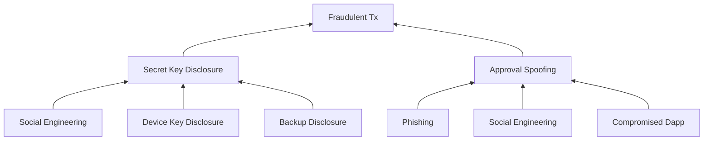
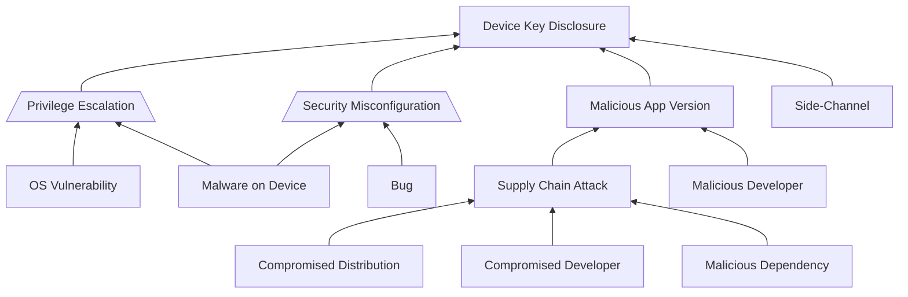
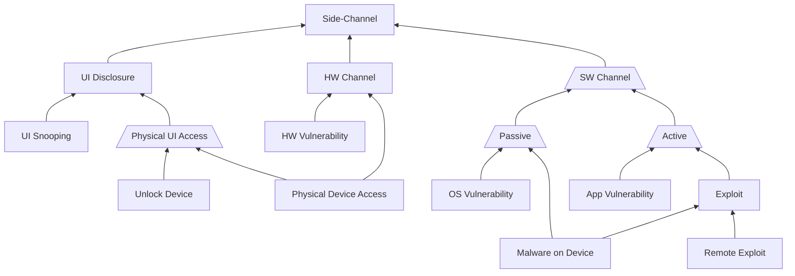
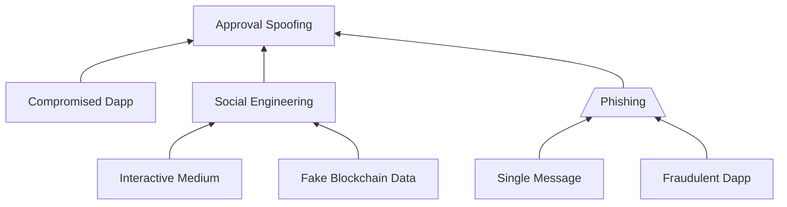
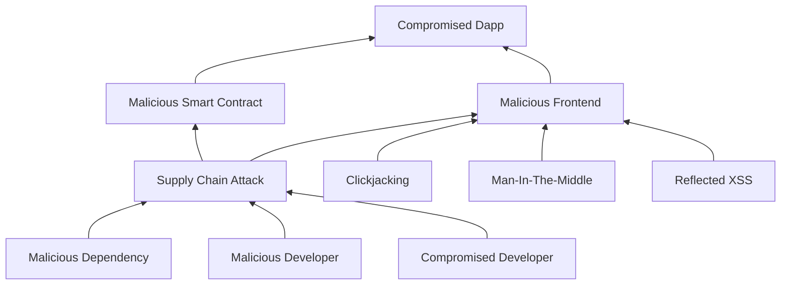

# Fraudulent Transaction Attack Tree

We present an attack tree for [fraudulent blockchain client
transactions](./security-model.md) and our measures to mitigate the threats. The
attack tree is broken into its components for legibility.

There are two causes of fraudulent transactions:

1. **Secret key disclosure:** the attacker learns the user's secret key and can
produce arbitrary transactions. The attacker may learn the user's secret key
from the user, from the device or from a backup.  
2. **Approval spoofing:** the user authorizes a transaction with different
parameters than they intended to or the user performs an action which leads to
authorizing a transaction without being aware of authorizing a transaction.
Approval spoofing may happen through deception attacks or through a compromised
dapp.

---

# Secret Key Disclosure

## Social Engineering

An attacker may trick the user to share their secret key with them.  We prevent
these attacks by never letting the user view or copy secret keys.

## Device Key Disclosure

The attacker learns the key from the user's device.

*Legend: trapezoid means all inputs necessary to carry out attack (AND gate).*

### Privilege Escalation

Malware on the user's device may use an operating system level privilege
escalation vulnerability to read keychain items and database files. We can't
defend against OS level privilege-escalation vulnerabilities.

### Security Misconfiguration

A bug in the app's source code may be exploited by malware on the user's device
to steal secret keys (eg. by exploiting incorrect keychain item permissions). We
defend against security misconfigurations by requiring code reviews for all
changes. Open source code serves as an additional defense-in-depth measure
against security misconfigurations.

### Malicious App Version

Installing a malicious SealVault version can compromise users' secret keys.

#### Supply Chain Attack

Supply chain attacks may target app distribution (how users acquire the app
bundle), the developers of the application or application dependencies (what
goes in the bundle).

#### Compromised Developer

The Apple ID that can submit new app versions is hardened with the following
measures:

- Long random unique password.
- Two-factor authentication enabled.
- Strong device passcodes.
- Trusted phone number hardened against SIM swapping.
- Recovery key enabled to disable account recovery through Apple support.  The
recovery key is stored in a bank safe.

The App Store review process provides a defense in depth measure as the time
delay between submitting and releasing app version gives time to react in case
the Apple ID is compromised.

#### Compromised Distribution

We rely on the iOS App Store for secure app distribution. 
We don't trust application assets that aren't distributed through the App Store.

#### Malicious Dependency

We rely on dependency pinning and Github's supply chain security
[features](https://github.com/features/security/software-supply-chain) to secure
our dependencies.

JavaScript being a popular, interpreted language with a global context and a
micro package-style ecosystem is especially vulnerable to supply chain attacks.
We don't have any JavaScript dependencies due to the prevalence of supply chain
attacks in the ecosystem.

#### Malicious Developer

Open source code and [reproducible builds](https://reproducible-builds.org/)
would protect against malicious SealVault developers.

While our code is open source, the iOS platform makes it [very
difficult](https://core.telegram.org/reproducible-builds#reproducible-builds-for-ios)
to produce reproducible builds and to support this feature SealVault developers
would have to work with jailbroken devices which would open up attack vectors on
the developers. We don't currently support reproducible iOS builds for this
reason, but will introduce reproducible iOS builds as soon as it's possible to
verify them without jailbroken devices.

---

### Side-Channel

The secret key can accidentally leak through a vector that wasn't intended to make
it possible to access the secret key.

### UI Disclosure

In a UI disclosure attack, the attacker learns the secret key by directly
viewing the user's screen either in person or remotely through a recording like a
CCTV camera.

### Hardware Side-Channel

In a hardware side-channel attack, an attacker that can take hold of a device to
perform measurements during the execution of the application to recover secret
keys or they can use a hardware vulnerability (eg.
[Meltdown](https://meltdownattack.com/)) to recover secret keys from the
application with their malware running on the device.

### Software Side-Channel

In a software side-channel attack, an attacker can write code that can either
passively observe the execution of the application or actively interact with
the application to recover secret keys. 

#### Passive Software Side-Channel

In a passive software side-channel attack the operating system leaks information
to the malware on the device about the application without the malware
interacting with the application. Examples: 

1. Malware can read the application's memory.
2. Malware can take a screenshot of the application. 
3. Clipboard snooping.

#### Active Software Side-Channel

In an active software side-channel, an attacker can utilize a legitimate way to
interact with the application to recover secret keys. The most prevalent active
software side-channel attacks are [timing
attacks](https://timing.attacks.cr.yp.to/) where the attacker measures the
response time of the application to recover secret keys.

### Side-Channel Defenses

#### Generic Defenses

We mitigate side-channel attacks by

1. Storing all user data encrypted on disk.  
1. Having an additional layer of encryption for secret keys inside the database
to avoid accidentally storing them in plain text in memory or in temporary files
created for logs and caches created by the database.
1. Storing key encryption keys in the local iOS keychain which is
[protected](https://support.apple.com/en-ie/guide/security/secb0694df1a/web) by
the iOS Secure Enclave HSM.
1. Keeping secrets stored in long-lived data structures of the application
encrypted.
1. Implementing all functionality that needs access to secrets in our Rust code 
inside designated modules to make it easy to follow data flows. Secret values
are zeroized on drop and stored on the heap to avoid leaving unreachable copies
one move.  Secret values have neither `Debug` nor `Display` implementations to
prevent leaking them in logs.

#### UI Disclosure & Screenshots

We prevent reading secret keys from the UI by never displaying them.

#### Clipboard Snooping

We prevent accessing secret keys through the clipboard by never allowing the
user to copy them.

#### Timing Side-Channel

We mitigate timing attacks by 

1. Using constant-time cryptographic implementations.
2. Not branching based on secret values in application code, unless it's a fatal
error. Conditions are checked with constant time comparison.
3. Rate limiting cryptographic operations that can be initiated by third-party
code without user interaction to mitigate attacks like
[Hertzbleed](https://www.hertzbleed.com/) that can bypass constant-time
safeguards, but need a large sample size.
4. Disabling cryptographic operations that can be initiated by third-party code
without user interaction when the application is in the background.
6. Scoping secrets used in cryptographic operations that can be initiated by
third-party code without user interaction to specific applications through the
[1DK](./one-dapp-per-key.md) model.

---

## Backup Disclosure

TODO pending finalizing backup design.

---

# Approval Spoofing

The user authorizes a transaction with different parameters than they intended 
to or the user performs an action which leads to authorizing a transaction 
without being aware of authorizing a transaction.

## Phishing and Social Engineering

### Social Engineering

A social engineering attack relies on a crook tricking the user to execute a
transaction. A novel social engineering threat for Web3 users is that crooks may
fake transactions to establish trust with a victim or a trade may be faked to
prompt copy trades.

We mitigate social engineering attacks with the following measures:

1. The [1DK](./one-dapp-per-key.md) model prevents social engineering attacks
   that rely solely on prompting user interaction with a fraudulent dapp.  If an
   attacker manages to convince the user to transfer significant funds into the
   fraudulent dapp, the [1DK](./one-dapp-per-key.md) model offers no protection
   for those funds.
1. We warn the user if they are about to approve a transaction for a dapp that
   they haven't transacted with before.
1. We warn the user if they are about to send a transaction to an address that
   they haven't transacted with before.
1. We warn the user if the blockchain data we display hasn't been verified
   locally.

### Phishing

Phishing is a type of social engineering attack where the attacker prompts the
user to perform an action advantageous to the attacker with a single message (as
opposed to a conversation in other social engineering attacks).

Phishing attacks for approval spoofing rely on prompting a user to interact with
a fraudulent dapp crafted to produce fraudulent transactions.  For example a
fraudulent dapp can ask a user to perform a signature in order to qualify for an
airdrop but instead of a signature it requests a transaction approval to
transfer funds to the attacker's address which the user may or may not notice.

We prevent such phishing attacks with the novel
[One-Dapp-per-Key](./one-dapp-per-key.md) (1DK) model.

---
## Compromised Dapp

An honest dapp may become compromised by changing its smart contract or front
end to produce fraudulent transactions.  For example, a compromised front end
may prompt the user to approve transactions with a different smart contract than
they intended to.

### Supply Chain Attack

SealVault offers the following mitigations against supply chain attacks on
dapps:

1. The 1DK model limits the damage a compromised dapp can do to the assets
belonging to that dapp.  
1. We warn the user if a smart contract has changed for a previously used dapp.
1. In the future we will warn the user about suspicious transactions based on
their previous usage of the dapp.

### Clickjacking

The 1DK model defends against
[clickjacking](https://owasp.org/www-community/attacks/Clickjacking) attacks as
detailed there.

### Man-In-The-Middle

We mitigate man-in-the-middle attacks on dapps by disallowing transactions and
signatures for dapps that were served over HTTP.

### Reflected XSS

The application must pass data to the dapp frontend JavaScript which could open
up a reflected XSS vector for messages from remote APIs.

We defend against reflected XSS by converting messages to binary JSON
represented as hexadecimal string literals before sending them to the dapp
frontend.  This is safe because it's not possible to break out of a string
literal enclosed in `"..."` with the hexadecimal character set `[0-9A-Fa-f]`.

