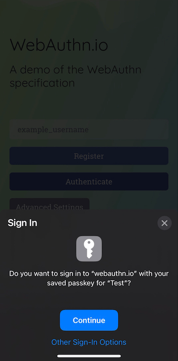
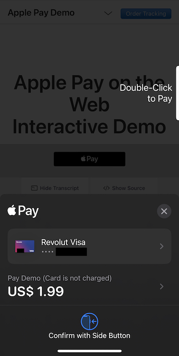
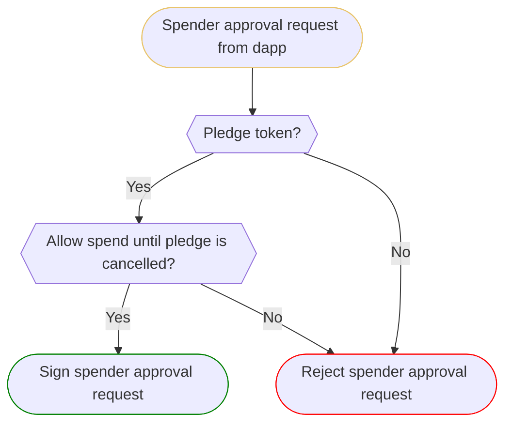

## Overview

When the provider generates [signatures](./in-page-provider.md#signatures) with
a key not specifically created for the dapp, it is cross-connected.
Cross-connecting keys is required to support certain [data
portability](./in-page-provider.md#data-portability) [use cases](#use-cases) for
web apps.

Cross-connecting keys without restrictions is [fundamentally
insecure,](./in-page-provider.md#data-portability) as it relies on users
identifying dangerous signature requests. Some in-page provider implementations
use wallet firewalls to mitigate this threat. Firewalls identify malicious
signature requests and offer warnings to users.

Wallet firewalls are a welcome addition to the Web3 security landscape, but they
have important shortcomings. The firewall’s threat intelligence may be out of
date, or it may give a false negative. If the firewall gives too many warnings,
users get desensitized, and if it’s too lax, then it's ineffective. Placing the
victim under time pressure is common in social attacks, so users are more likely
to ignore warnings than normally. Finally, if every new dapp comes with a
warning, that discourages experimentation, so even if firewalls reduce harm of
phishing, they can hamper the growth of the ecosystem.

While most [in-page provider](./in-page-provider.md) implementations let users
cross-connect keys without restrictions, our approach to security is to
[eliminate attack vectors](./security-model.md#deception-mitigation) where we
can.  Therefore, in cross-connect mode, we reduce the decision the user has to
make to sign in, payment approval and token pledge decisions and reject
signature requests where we cannot guarantee this. If a signature request is
blocked, users are guided to switch to the [dapp key](./dapp-keys.md) to
continue. The dapp key is an isolation mechanism that
[guarantees](./dapp-keys.md#automatic-signature-approval) that a malicious dapp
cannot exploit assets that the user explicitly trusted it with.

## Use Cases

The following [data portability](./in-page-provider.md#data-portability)
patterns for web apps need cross connect:

| UX                                    | Technical            | Example                                                                                                                                                                                                                             |
|---------------------------------------|----------------------|-------------------------------------------------------------------------------------------------------------------------------------------------------------------------------------------------------------------------------------|
| [Sign In](#sign-in)                   | Off-chain signature  | - Prove ownership of an address (eg. [SIWE](https://eips.ethereum.org/EIPS/eip-4361) or accept ToS).   - Prove ownership of assets (e.g. [nf.td](https://nf.td/) and [Phi Land](https://philand.xyz/)).                         |
| [Payment Approval](#payment-approval) | Token transfer event | - Mint an NFT based on an allow list or holding an asset (e.g.: [Sunflower Land](https://sunflower-land.com/) + [Bumpkins](https://bumpkins.io/), [Lens](https://www.lens.xyz/) ecosystem.). - Supplying collateral for a loan. |
| [Pledge Approval](#pledge-approval)   | Token approval event | - Listing a game item for sale on an exchange while playing the game (e.g.: [Sunflower Land](https://sunflower-land.com/).                                                                                                                                                             |

## Sign In

Internet users are familiar with the concept of signing in to a website with
a password or through a social provider. Recently, passwordless logins based on
[WebAuthn](https://developer.mozilla.org/en-US/docs/Web/API/Web_Authentication_API)
started to take off. 

<figure markdown>
{ loading=lazy }
<figcaption>
Passwordless login on iOS with WebAuthn.
</figcaption>
</figure>

Proving ownership of an address in the Ethereum ecosystem is very similar from a
UX perspective to passwordless sign in. Therefore, we present signature approval
requests to prove ownership of an address as sign in requests, even if sometimes
they are authorization requests from a technical perspective (as opposed to
authentication requests).

## Payment Approval

Internet users are familiar with making online payments. In cross-connect mode
we strive to provide the same payment approval experience as making payments
with Apple Pay.

<figure markdown>
{ loading=lazy }
<figcaption>
Apple Pay prompt on iOS.
</figcaption>
</figure>

## Pledge Approval

[Spender approval](./in-page-provider.md#spender-approvals) is a novel concept
introduced by Ethereum. Its purpose is to let decentralized exchanges settle
trades based on users' orders. Spender approval must be supported in
cross-connect mode, because playing a game using one
[dapp](./dapp-keys.md#what-is-a-dapp) while trading game items using another
dapp is a common usage pattern.

There are two challenges we need to solve in order to provide a secure and
smooth experience for spender approvals:

1. Since spender approval is a novel concept, we need to make sure that the
   prompt that we display matches the user's intention while making sure at the
   same time the user understands the consequences of giving a spender approval.
2. We need to keep track of approvals and let users find and revoke them in a
   way that matches their mental model.

### Pledge Approval Dialog

In order to solve first challenge, we use a two phase approval dialog:

### Revoke Pledge

!!! warning "WIP"

    This section is still work in progress.

## Handling Signature Requests

We categorize all signature requests received by the in-page provider as one of
the following categories:

1. [Sign in](#sign-in) request
2. [Payment](#payment-approval) request
3. [Token pledge](#pledge-approval) request
4. Unknown

We cannot interpret all signature requests as one of the first three categories,
hence the need for an unknown category. If that's the case, we reject the
request and direct the user use the [dapp key](./dapp-keys.md) to continue.

Identifying sign in requests is challenging, because there is no standard format
to prove ownership of an address.

Identifying payment and token pledge requests is challenging, because, while we
can simulate the outcome of [on-chain
signatures](./in-page-provider.md#on-chain-signatures) to learn the outcome,
[off-chain signatures](./in-page-provider.md#off-chain-signatures) can lead to
on-chain transactions as well and there is no standard format that can be used
to interpret the signed data programmatically.

### Handling Sign In Requests

!!! warning "WIP"

    This section is still work in progress.

### Handling Payment and Token Pledge Requests

#### Data Needed

We need to extract the following data from the
[on-](./in-page-provider.md#on-chain-signatures) and
[off-chain](./in-page-provider.md#off-chain-signatures) signature requests for
the payment and pledge approval dialogs:

- Native token spent on network fees
- Native token transferred
- Fungible token transferred
- NFT transferred
- Spender approval
- Transfer recipient
- Native token received             
- Fungible token received
- NFT received

In addition, we'll need to know the USD value of tokens to prevent the user
misidentifying what value the token has. We can query the USD values through
blockchain APIs.[^10] 

#### On-Chain Signatures

We can use transaction simulation to extract the [data we need](#data-needed)
from [on-chain signature](./in-page-provider.md#on-chain-signatures) requests.

!!! warning "WIP"

    This section is still work in progress.

#### Off-Chain Signatures

There is no universal solution to extract the [data we need](#data-needed) from
[off-chain signature](./in-page-provider.md#off-chain-signatures) requests.

Off-chain signature requests that are payment or pledge approval[^20] requests
typically follow the [EIP-712](https://eips.ethereum.org/EIPS/eip-712) standard,
but the standard only defines the format of the signed data, not its semantics.
Therefore, in order to extract the [data needed,](#data-needed), we have to
support application-specific protocols such as
[Seaport](https://docs.opensea.io/reference/seaport-overview). We should drive
standardization in the ecosystem to reduce the implementation burden on us.

!!! warning "WIP"

    This section is still work in progress.

[^10]:
    A faulty or malicious blockchain API can send wrong values. This an attack
    vector that we don't against currently.

[^20]:
    Spender approval with off-chain signatures is rare, but it's standardized in
    [EIP-2612.](https://eips.ethereum.org/EIPS/eip-2612)
