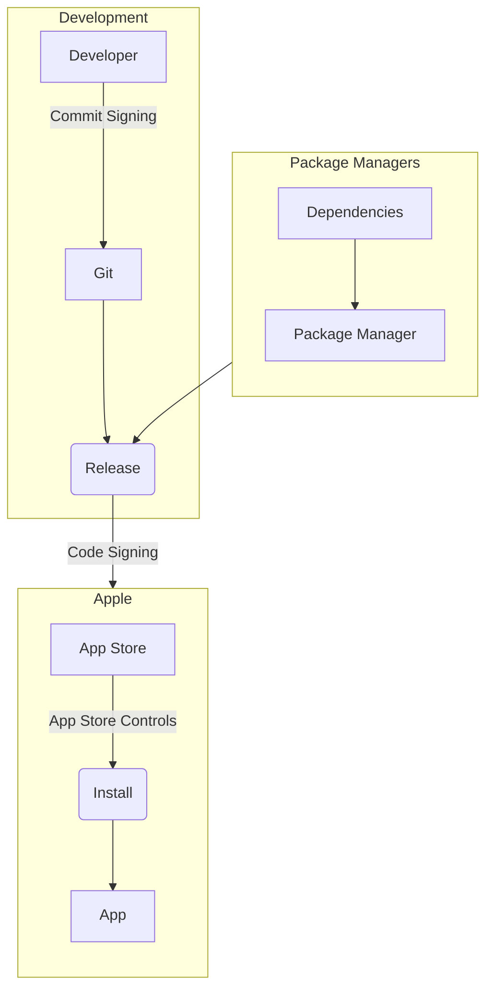
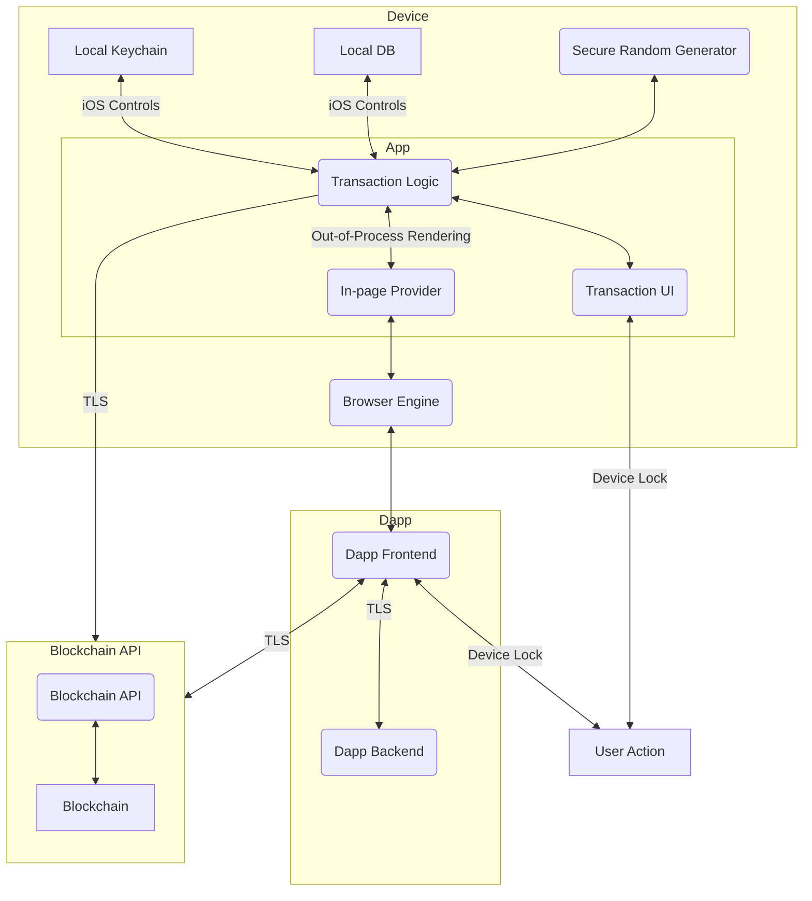
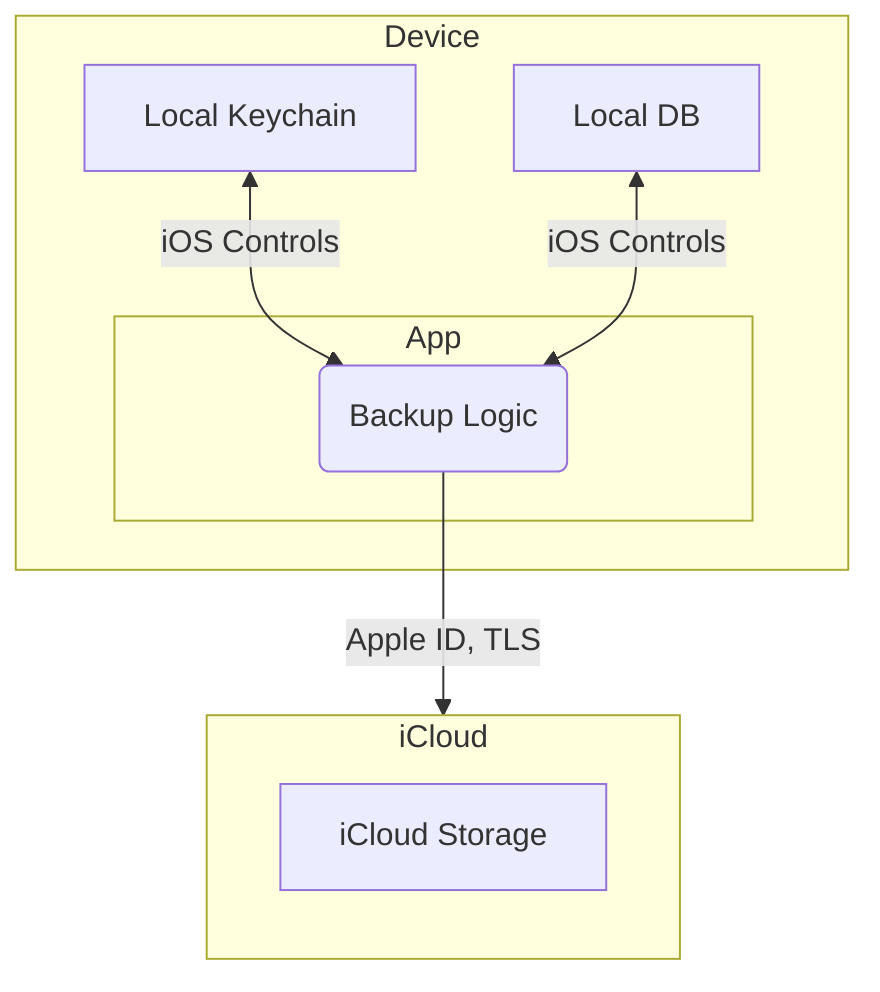

# Data-Flow Diagrams

Contains assets, stores, security controls and trust boundaries.

Mitigations of attacks are in the [attack tree.](./attack-tree.md)

## Supply Chain

## Transactions

## Backup

