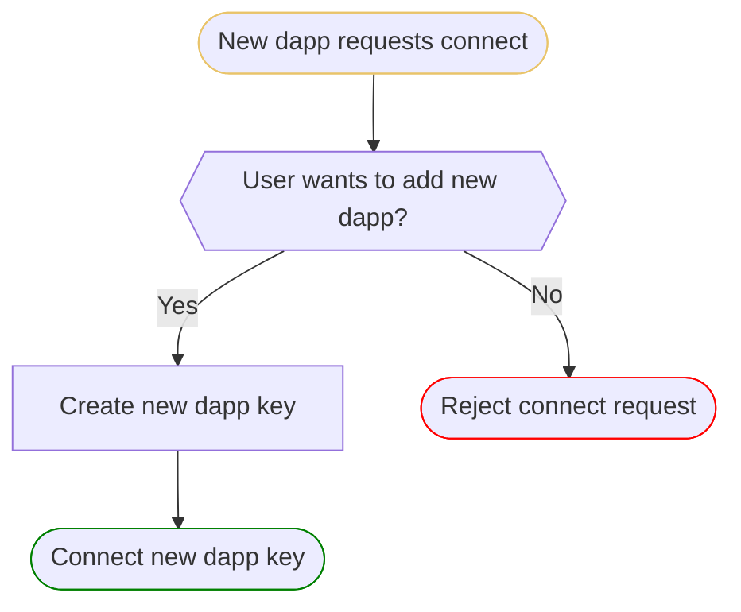
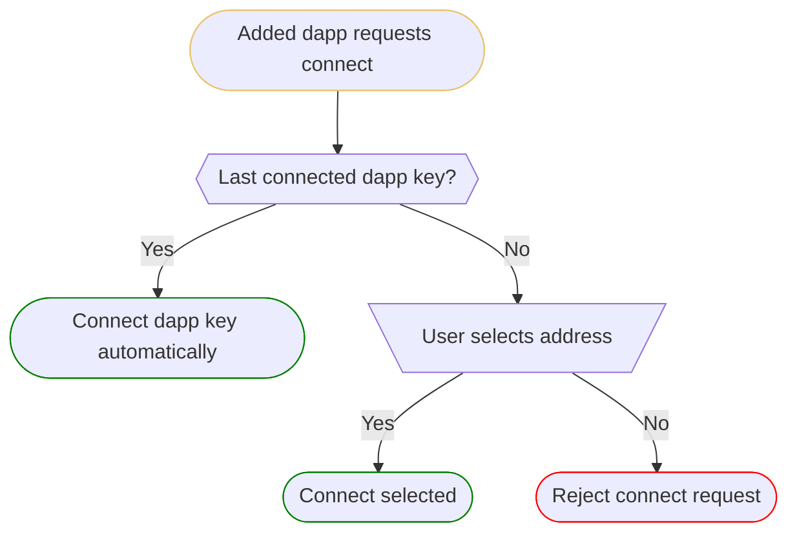

## Overview

The in-page provider exposes protocol-specific functionality through the web
browser to dapps. A dapp is a web app that interacts with smart contracts
through its front end code. The in-page provider lets dapps can generate signatures with the user's keys. 

We'll discuss in-page providers in the context of the Ethereum ecosystem
([EIP-1193](https://eips.ethereum.org/EIPS/eip-1193)) in the following.

## Signatures

Dapps can request to generate on- and off-chain signatures with the user's keys
through the in-page provider.

### On-Chain Signatures

An on-chain signature is a signature that can be submitted along with the signed
data through the
[`eth_sendRawTransaction`](https://ethereum.org/en/developers/docs/apis/json-rpc/#eth_sendrawtransaction)
method. The on-chain signature is verified by the validator node before a
transaction is included in a block.

The data signed by on-chain signatures follows a [standard
format,](https://docs.ethers.org/v5/api/providers/types/#providers-TransactionRequest)
and it can be used to simulate the on-chain changes caused by a signature.

### Spender Approvals

Both the fungible ([EIP-20](https://eips.ethereum.org/EIPS/eip-20#approve)) and
non-fungible token standards
([EIP-721](https://eips.ethereum.org/EIPS/eip-721#specification),
[EIP-1155](https://eips.ethereum.org/EIPS/eip-1155#approval)) support approving
a spender other than the owner for tokens with a transaction. This mechanism is
typically used to implement a clearing mechanism for exchanges.

Once a spender approval is granted to a third party, the user's token can be
transferred by that third party without further involvement from the user. The
application must keep track of approvals given by the user through the in-page
provider and let the user revoke them later.

### Off-Chain Signatures

An off-chain signature is a valid signature that validator nodes refuse to
accept for a transaction.

Off-chain signatures are used for off-chain authorization purposes (e.g. sign-in
with Ethereum) or for gasless transactions. There are two types of gasless
transactions: meta-transactions and the approve-then-sign pattern. There are no
standards for the payload that the user signs for either type. The payload
cannot be used to simulate the on-chain changes caused by a signature.

#### Meta-Transactions

Meta-transactions are governed by the
[EIP-2771](https://eips.ethereum.org/EIPS/eip-2771) standard. Meta-transactions
require opt-in by the token implementor to trust an other smart contract to
verify that the transaction originates from the token owner (as opposed to
checking `msg.sender` normally). [OpenGSN](https://opengsn.org/) is a popular
relayer.

There is no requirement in [EIP-2771](https://eips.ethereum.org/EIPS/eip-2771)
that meta-transaction relayers verify the user's ownership of a token through
off-chain signatures, but it seems to be common practice.

#### Approve-Then-Sign

In the approve-then-sign pattern, the user approves a spender through the
standard token interface methods and then the spender collects an off-chain
signature from the user to transfer the token without needing an additional
on-chain transaction. A popular example is OpenSea's
[Seaport](https://docs.opensea.io/v2.0/reference/seaport-overview) framework.

We should note that there is no standard that requires the spender to request an
off-chain signature from the token owner before they'd spend the token.

## Data Portability

Being able to port data across applications permissionlessly is the [core value
proposition](https://sealvault.org/blog/web3/#how-can-web3-go-wrong) of Web3.
There are three means of data portability in Web3:

- token transfers
- copying keys
- performing signatures with the keys

The in-page provider plays a central role in data portability between web apps.
It lets multiple web apps perform signatures with a key without granting the web
apps access to the key material.

While the key material is safe in this setting, the security of the user's
assets relies on the user's ability to detect malicious signature requests. This
is fundamentally unsafe, since it is impossible for non-technical users to
detect malicious signature requests and social engineering attacks can put even
the most technically sophisticated user under enough pressure to make a mistake.

## Dapp Keys And Cross-Connect

At SealVault, we automate what we can for users and when we cannot automate
something, we reduce decisions to their simplest form. For this reason, we
distinguish between two modes of operation for the provider. In the first mode,
the provider generates signatures with a key specifically created for the dapp
([dapp key](./dapp-keys.md)). In the second mode, the provider generates
signatures with a key not specifically created for the dapp ([cross-connected
key](./cross-connect.md)).

With [dapp keys,](./dapp-keys.md) we can completely automate the in-page
provider for the user, but in order to support all aspects of [data
portability](#data-portability), we have to let users connect dapp keys to other
dapps.  As mentioned, this is fundamentally unsafe, and the Ethereum ecosystem
is slowly moving away from this model with signature based delegation,[^10] but
many dapps still rely on it.[^15] We support
[cross-connecting](./cross-connect.md) wallets and dapp keys and reduce the
security decisions user have to make when a key is cross-connected to sign-in,
payment approval or token listing decisions.

### New Dapp Flow

When a new [dapp](dapp-keys.md#what-is-a-dapp) requests to connect for the first
time, the in-page provider asks the user through a dialog if they want to add
this new dapp, creates a new [dapp key](./dapp-keys.md) for the dapp and
connects the new dapp key automatically. Defaulting to creating a new [dapp
key](./dapp-keys.md) and connecting that by default protects the user from
phishing that relies on misidentifying the dapp that the user interacts with.

### Added Dapp

When a [dapp](dapp-keys.md#what-is-a-dapp) that was added before by the user
requests to connect, if [dapp key](./dapp-keys.md) was last connected, then auto
connect it, else request from user which to connect. The default in the
selection is the last connected address.

[^10]:
E.g. [Delegate Cash](https://delegate.cash/),
[Farcaster](https://www.youtube.com/watch?v=ZzySey1azWM),
[Delegatable](https://delegatable.org/),
[MUD](https://github.com/latticexyz/mud/issues/327).

[^15]:
E.g. [Sunflower Land](https://sunflower-land.com/), [Phi](https://philand.xyz/),
[Lens](https://www.lens.xyz/) ecosystem.
