# Token Transfer Traces

## Overview

This document explains the different ways a token can be transferred from an
externally owned account (EOA) with the Ethereum protocol. It is a companion to
the custom token transfer [TLA+
spec.](https://github.com/sealvault/sealvault/blob/main/tools/tla/TokenTransfer.tla)
There is also a [blog post](/blog/2023/04/token-transfer-tla) that
explains the TLA+ spec.

The document differentiates between custom and native tokens, but not between
custom tokens ([ERC-20](https://eips.ethereum.org/EIPS/eip-20),
[ERC-721](https://eips.ethereum.org/EIPS/eip-721),
[ERC-1155](https://eips.ethereum.org/EIPS/eip-1155)) and ignores the different
transfer methods of contracts. Gas fees are not modelled.

## Native Token Transfer

A native token transfer happens without contract execution. 

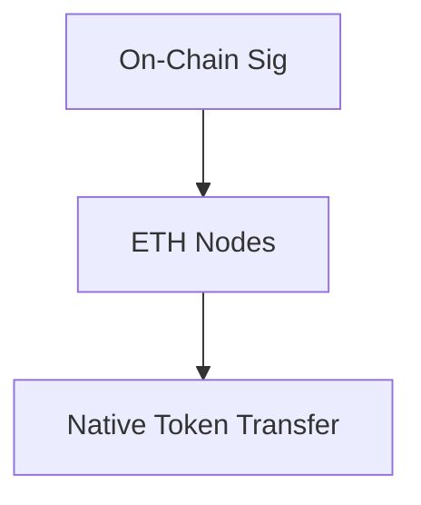

## Custom Token Transfer

The simplest form of transferring a custom token is with a single on-chain
signature. The caller of the transfer method of the token contract must be the
token owner EOA in this case.

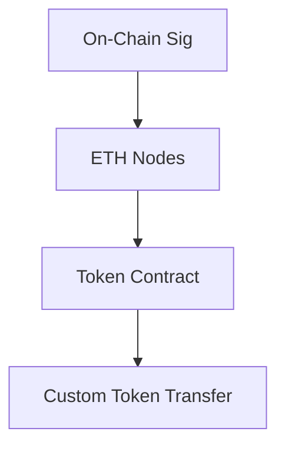

## Custom Token Approval

The token owner EOA can allow an other address (EOA or contract) to spend the
token with an approval.

### EOA spender

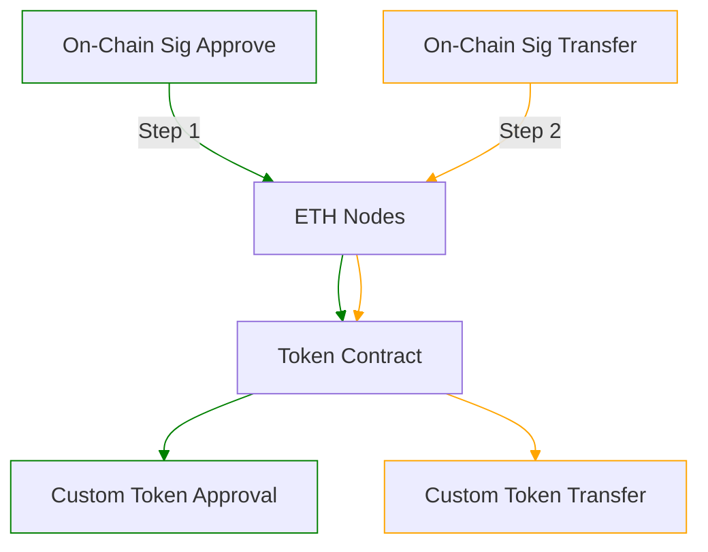

### Contract Spender

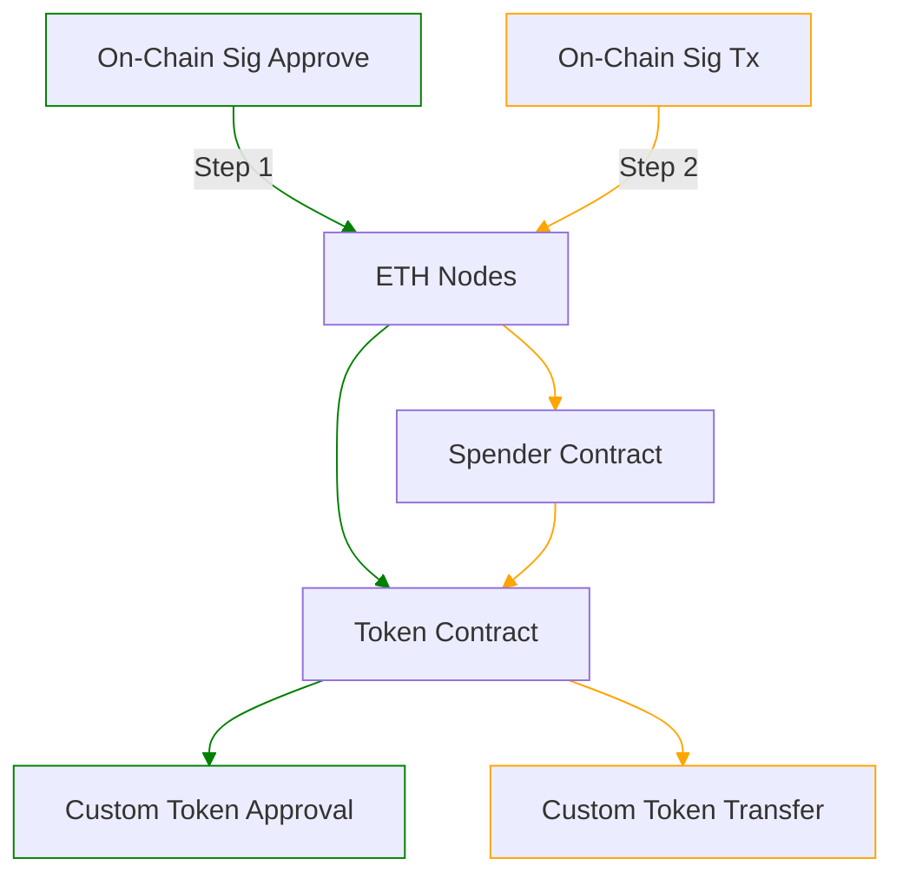

### Off-Chain Spend

Following an on-chain spender approval by the token owner, an off-chain
signature by the owner can suffice to execute a transfer of the token. This
pattern is typically used by exchanges and marketplaces such as [CoW
Swap](https://docs.cow.fi/) and
[Seaport.](https://docs.opensea.io/reference/seaport-overview)

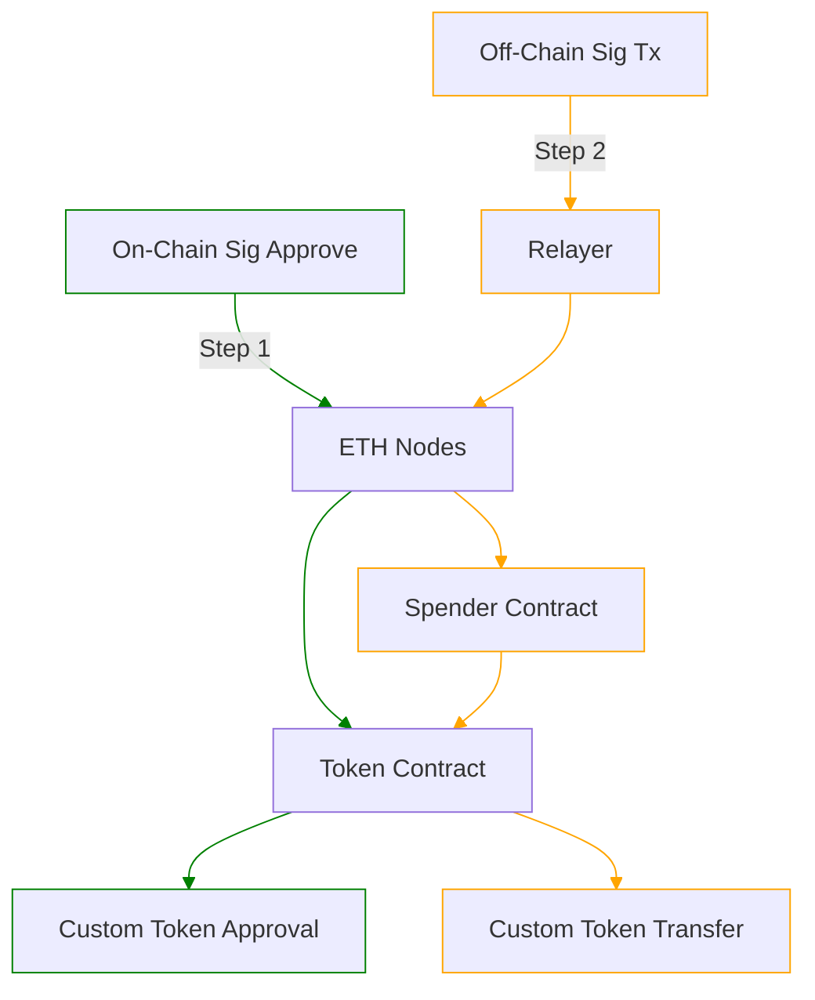

### Permit

If a token contract implements the permit extension defined in
[ERC-2612](https://eips.ethereum.org/EIPS/eip-2612), the token owner EOA can
grant a spender approval to an address (EOA or contract) with an off-chain
signature. The permit message doesn't have to be passed by the EOA to the token
contract. [More
info.](https://github.com/dragonfly-xyz/useful-solidity-patterns/tree/main/patterns/erc20-permit)

#### Permit Contract Spender

##### Permit Contract Spender Single Tx

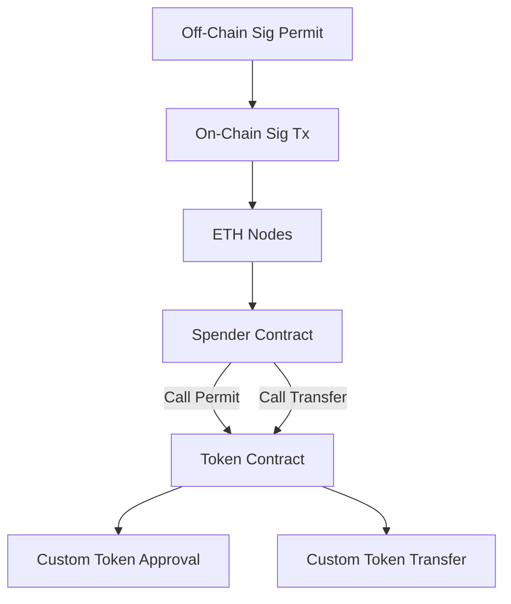

##### Permit Contract Spender Multiple Tx

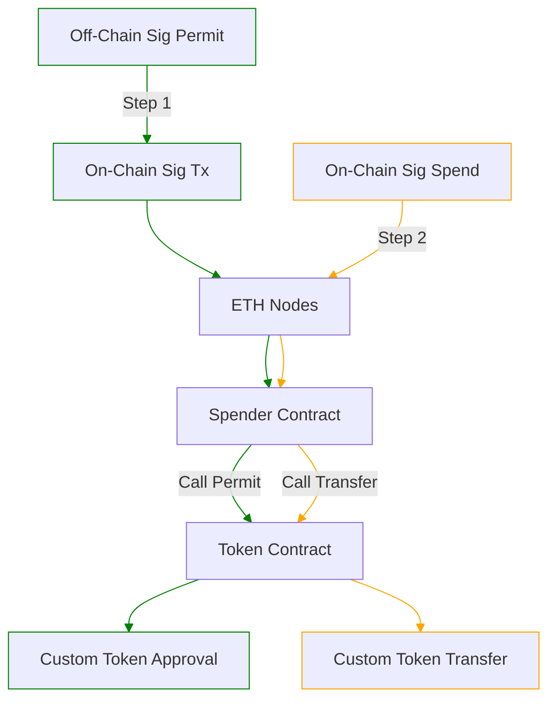

#### Permit EOA Spender

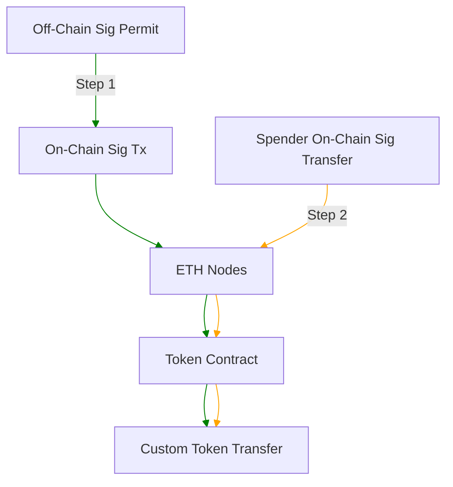

### Permit2

Single spender contract used by all protocols. Advantage over [ERC-20
Permit](#erc-20-permit) is that it doesn't need changes to the token contract. [More info.](https://github.com/dragonfly-xyz/useful-solidity-patterns/tree/main/patterns/permit2)

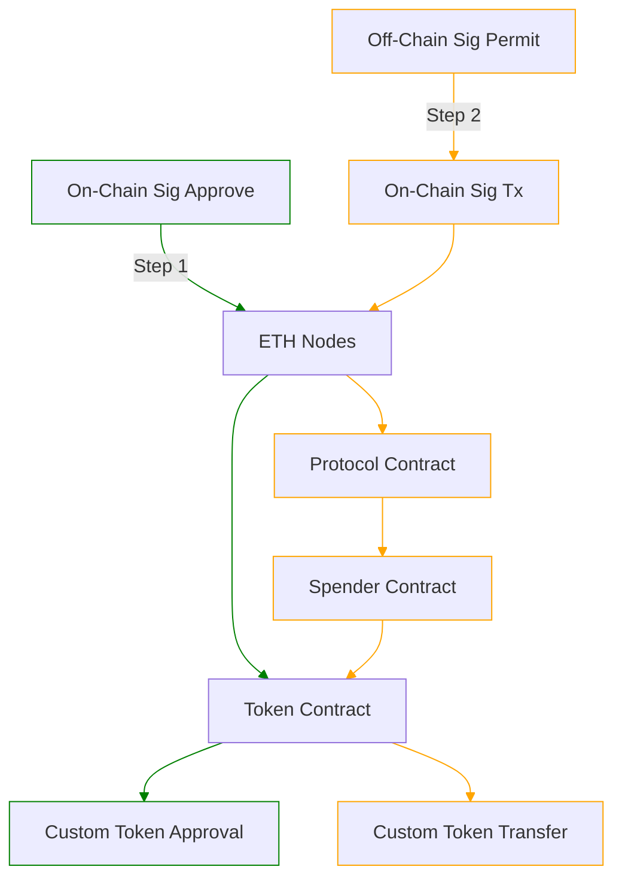

## Meta Transaction

With meta transactions ([ERC-2771](https://eips.ethereum.org/EIPS/eip-2771)),
the token implementation trusts a forwarder contract to feed it transactions to
save gas fees for the EOA. The token contract treats method calls from the
forwarder as if they were called by the EOA directly. 

It is assumed that the forwarder contract verifies off-chain signatures by the
user, but it's not verified by the token contract. If the relayer fails to
verify the owner's signature, we treat that as a vulnerability of the token
contract, since it's the token contract that chooses to trust the relayer.

### Meta Custom Token Transfer

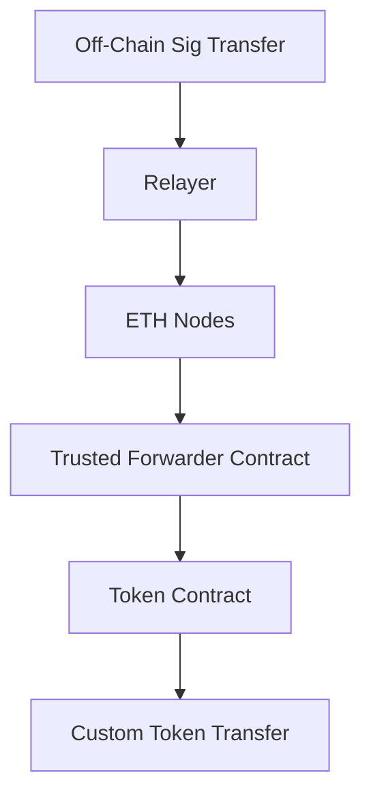

### Meta Custom Token Approval

#### Meta EOA spender

Token approval with meta transaction where the spender is an EOA. On the 2/A
path, the approved spender transfers the token through a meta-transaction. On
the 2/B path, the approved spender EOA transfers the token via a normal
transaction.

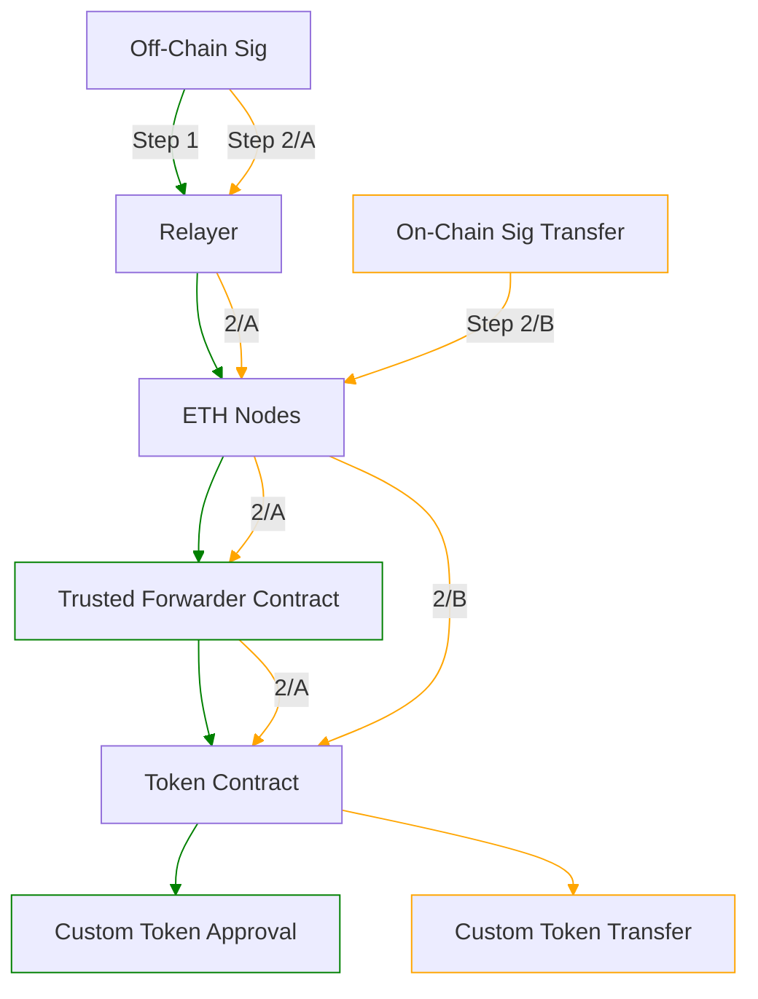

#### Meta Contract Spender

Token approval with a meta transaction where the spender is a contract. On the
2/A path the spender contract itself allows meta transactions, so the spender
transfers the token with a meta transaction. On the 2/B path, the spender
transfers the token with a normal transaction.

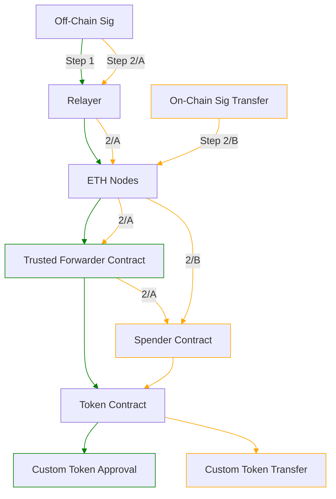
