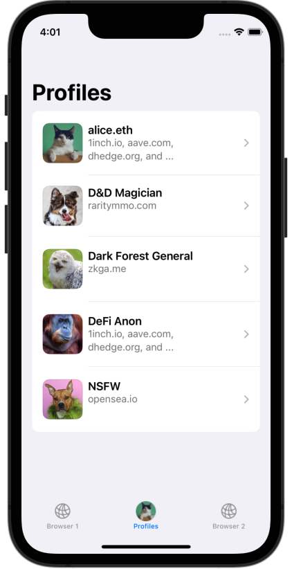
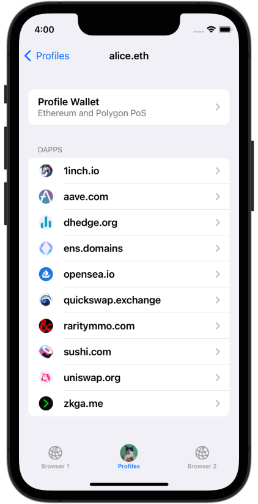
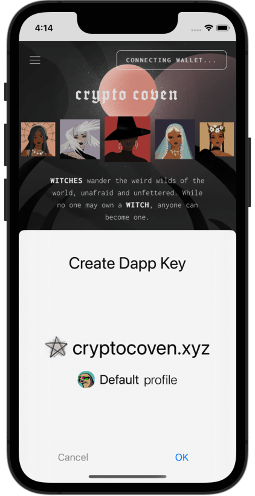
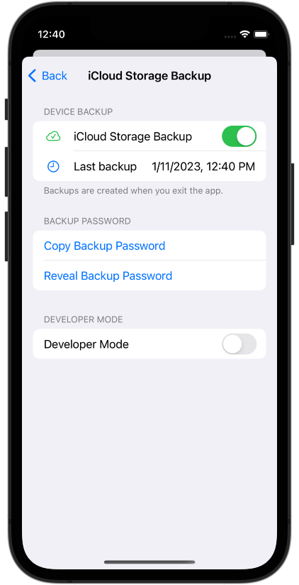
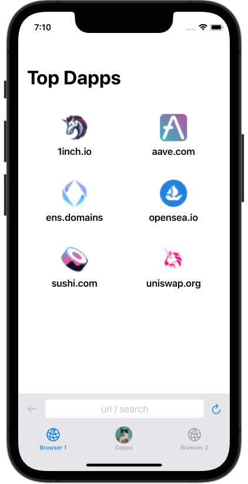
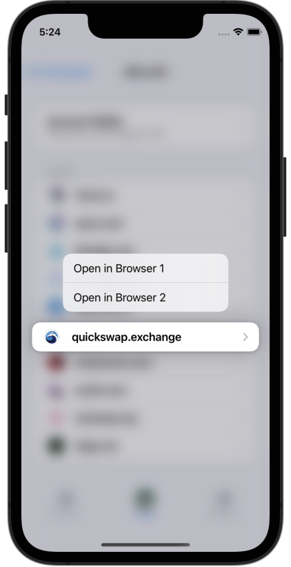

<figure markdown>

<figcaption></figcaption>
</figure>

SealVault is an open source project to build a self-custody Web3 key manager app
that is primarily used for everyday browsing with social and gaming dapps.

[Subscribe to our newsletter](https://sealvault.substack.com/subscribe){ .md-button .md-button--primary .sv-button-primary-color }

## User Problems

Wallet users who regularly use social and gaming dapps and like to experiment
with new stuff have the following problems:

-  :fontawesome-solid-skull-crossbones: __Getting Hacked__

    ---

    Users are worried about trying out new dapps, because malicious dapps can easily
    steal their stuff.

    **Solutions: [Dapp Keys](./dapp-keys.md) & [Cross Connect](./dev-docs/design/cross-connect.md)**

-  :fontawesome-solid-seedling: __Seed Phrases__

    ---

    Wallets use seed phrases for backup and portability. Seed phrases are both
    annoying and insecure.
    
    **Solution: [Self-Custody Cloud Backup](./backup.md) & Social Recovery**

-  :fontawesome-regular-id-badge: __Getting Doxxed__

    ---

    Users want their gaming identity, dating identity and shitpost accounts to be
    isolated. This is challenging with blockchains where all data is public and
    addresses are easily linked publicly with on-chain transactions. 

    **Solution: [Profiles](./profiles.md)**

-  :fontawesome-solid-face-tired: __Approval Fatigue__

    ---

    Wallets have too many popups. Most signature approval can and should be
    automated and when it cannot be automated, users should have simple prompts like
    “sign in” or “pay” where they can trust the outcome.

    **Solutions: [Dapp Keys](./dapp-keys.md) & [Cross Connect](./dev-docs/design/cross-connect.md)**

-  :material-sync-off: __Missing Sync__

    ---

    Users often want to use the same keys on different devices, but wallets don’t
    support syncing keys and settings between devices.

    **Solution: E2EE Cross-Platform Sync**

-  :fontawesome-solid-face-tired: __Poor Mobile UX__

    ---

    It's difficult to launch dapps and multitask in mobile wallets.
 
    **Solutions: [Quick Launch](#quick-launch) & [Multitasking](#multitasking)**

## Features

-   :material-account-multiple: __Multiple Identities__
    <figure markdown class="sv-center-block" id="profiles">
    { loading=lazy }
    <figcaption>
    Organize your dapps into profiles for isolated identities.
    [More](./profiles.md)</figcaption>
    </figure>
    
-   :material-key-plus: __Dapp Keys__
    <figure markdown id="dapp-keys">
    { loading=lazy }
    <figcaption>
    You can create keys for each dapp that you add.
    This mitigates damage from compromised dapps and enables automatic transaction approval.
    [More](./dapp-keys.md)
    </figcaption>
    </figure>

-   :material-robot: __Automated Transaction Approval__
    <figure markdown id="automated-transaction-approval">
    { loading=lazy }
    <figcaption>
    You decide which dapp to add, after that transactions are approved
    automatically. [More](./dapp-keys.md)
    </figcaption>
    </figure>

-   :material-cloud-lock: __Self-Custody Backup__
    <figure markdown id="backup">
    { loading=lazy }
    <figcaption>
    Automatically back up your keys and profiles to your iCloud Storage. [More](./backup.md)
    </figcaption>
    </figure>

-   :material-rocket-launch: __Quick Launch Your Favorite Dapps__
    <figure markdown id="quick-launch">
    { loading=lazy }
    <figcaption>
    Best-in-class dapp browser with helpful notifications about dapp transactions.
    </figcaption>
    </figure>

-   :material-card-multiple: __Built for Multitasking__
    <figure markdown id="multitasking">
    { loading=lazy }
    <figcaption>
    Open two dapps side-by-side and switch with a single tap while both of them remain connected.
    </figure>
    

## Roadmap

- [X] [Security model](./dev-docs/design/security-model.md)
- [X] Cross-platform core in Rust
- [X] iOS app with built-in browser ([TestFlight](https://testflight.apple.com/join/EHQYn6Oz))
- [X] Ethereum and Polygon support
- [X] [Dapp keys](./dapp-keys.md)
- [X] [Profiles](./profiles.md)
- [X] [Self-custody cloud backup](./backup.md)
- [ ] [Cross-connect](./dev-docs/design/cross-connect.md)
- [ ] In-app on-ramp
- [ ] [Key export](https://github.com/sealvault/sealvault/issues/39)
- [ ] MacOS app
- [ ] E2EE cross-platform sync
- [ ] Support for more chains and decentralized protocols 
- [ ] Social recovery
- [ ] Cross-profile zero-knowledge proofs
- [ ] Android, Windows and Linux apps
- [ ] Password storage & WebAuthn/Passkey support

## Get Involved

- [Telegram](https://t.me/agostbiro)
- [GitHub Repo](https://github.com/sealvault/sealvault)
- [MPL 2.0](https://www.tldrlegal.com/license/mozilla-public-license-2-0-mpl-2) license
- We &#10084;&#65039; PRs and forks
