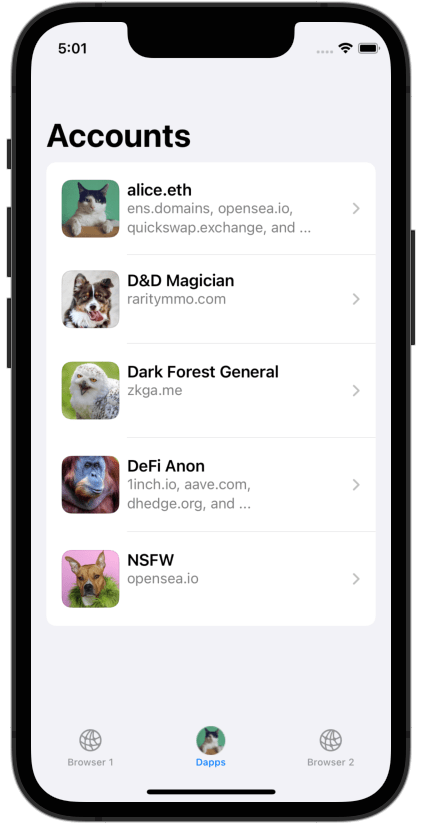
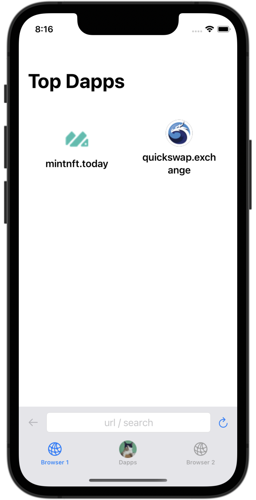

<h1 hidden>This is a hack to prevent the static site generator auto-inserting a title</h1>

<figure markdown>

<figcaption></figcaption>
</figure>

!!! tip "Experiment freely with Web3"
    SealVault is the first key manager with automated transaction approval.
    This keeps you safe and gets out of the way simultaneously.

## Features

-   __One-Dapp-per-Key__
    <figure markdown>
    { loading=lazy }
    <figcaption>
    Each dapp gets a separate key.
    This protects you from phishing and mitigates compromised dapps.
    [More](./one-dapp-per-key.md)
    </figcaption>
    </figure>

-   __Multiple Identities__
    <figure markdown>
    { loading=lazy }
    <figcaption>
    Organize your dapps into accounts for isolated identities.
    [More](./privacy.md)</figcaption>
    </figure>

-   __Quick Launch Your Favorite Dapps__
    <figure markdown>
    { loading=lazy }
    <figcaption>
    Best-in-class dapp browser with helpful notifications about dapp transactions.
    [More](./one-dapp-per-key.md)
    </figcaption>
    </figure>

-   __Built for Multitasking__
    <figure markdown>
    { loading=lazy }
    <figcaption>
    Open two dapps side-by-side and switch with a single tap while both of them remain connected.
    </figure>

-   __Move Assets Between Wallets and Dapps__
    <figure markdown>
    { loading=lazy }
    <figcaption>
    You can also transfer a pre-configured amount automatically when you add a new
    dapp. [More](./one-dapp-per-key.md)
    </figcaption>
    </figure>
    
-   __Automated Transaction Approval__
    <figure markdown>
    { loading=lazy }
    <figcaption>
    You decide which dapp to add, after that transactions are approved
    automatically. [More](./one-dapp-per-key.md)
    </figcaption>
    </figure>

-   __Multi chain__
    - Currently: Ethereum and Polygon PoS
    - Planned: all the chains &#127881;

-   __Cross platform__
    - Currently: iOS
    - Next: Android
    - Planned: MacOS, Window, Linux
    - Self-custody backups and E2EE sync

-   __Open source for real__
    - [GitHub Repo](https://github.com/sealvault/sealvault)
    - [MPL 2.0](https://tldrlegal.com/license/mozilla-public-license-2.0-%28mpl-2%29) license
    - We &#10084;&#65039; PRs and forks

## Beta

Sign up for iOS beta invite [here.](https://form.typeform.com/to/DxKsEMKM)
